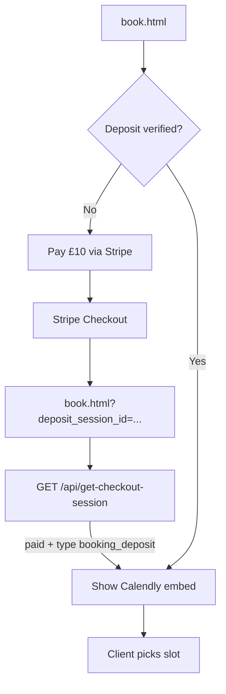

# Live booking integration

The booking page uses a **Calendly inline embed** for live scheduling.

**Live event URL:** https://calendly.com/krownfrontz/impression-appointment-krownfrontz

## Site integration

- [`book.html`](../book.html) uses a **split layout**: Calendly on the left, design summary on the right.
- Calendly is initialized from [`main.js`](../main.js) via `Calendly.initInlineWidget` (not declarative markup) so style choices can be pre-filled.
- Mock calendar JS (`initBookCalendar`, etc.) only runs when `#book-calendar` exists — it is bypassed on the live booking page.
- Style notes and contact fields are handled in Calendly (not on the site form).
- The **£10 booking deposit** is collected via **site Stripe Checkout** before the Calendly calendar is shown.

### Booking deposit flow



| Step | What happens |
| --- | --- |
| 1 | User sees **Pay booking deposit** panel; Calendly is hidden |
| 2 | **Pay £10 deposit with Stripe** → `POST /api/create-booking-deposit-session` |
| 3 | Stripe Checkout → success URL `book.html?deposit_session_id={SESSION_ID}` |
| 4 | `initBookDepositGate()` verifies session (`paid` + `metadata.type === "booking_deposit"`) |
| 5 | Verified session ID stored in `sessionStorage` (`kf-booking-deposit-session`) |
| 6 | Calendly embed loads; user picks date/time |

**API endpoints:**

- `POST /api/create-booking-deposit-session` — creates £10 GBP Stripe Checkout session
- `GET /api/get-checkout-session?session_id=...` — verifies payment; returns `{ paid, type }` only (no email or amount exposed to browser)

**Deposit enforcement (required):** The site Stripe gate alone is not enough. Configure Calendly so the event cannot be booked without paying the deposit:

1. Open [Impression Appointment event](https://calendly.com/krownfrontz/impression-appointment-krownfrontz).
2. **Hide from public profile** — event must not appear on your Calendly landing page or be discoverable via search.
3. **Embed-only access** — Share → Add to website → Inline embed → **Allowed domains**:
   - `krownfrontz.com` and `www.krownfrontz.com`
   - Netlify preview domain (staging only, if used)
   - `localhost` (local dev only)
4. Do **not** share the direct scheduling link publicly (social, email footers, etc.).
5. Confirm the event is **active** and calendar integration is connected.

**Residual risk:** Anyone who already has the direct Calendly URL can still book without paying. Do not distribute that link. For server-side deposit tracking, revisit Stripe webhook + Calendly API cross-check if abuse appears.

### Layout

| Column | Content |
| --- | --- |
| Left | Deposit gate, then Calendly embed in `.book-calendly-frame` |
| Right | **Your design** panel when arriving from shop/product/cart; **Browse styles** helper otherwise |

Design data comes from `getBookingSelections()` (cart line, `?design=1`, or `kf-booking-flow` session + product draft).

### Embed parameters

| Param / attribute | Purpose |
| --- | --- |
| `hide_event_type_details=1` | Single-column calendar — event info is on the page title |
| `hide_gdpr_banner=1` | Hides Calendly cookie banner inside the embed |
| `resize: true` | Auto-adjusts iframe height per booking step |
| `min-height: 630px` | Starting height on `.book-calendly-frame` |

Do **not** add `primary_color`, `text_color`, or `background_color` to the embed URL unless you are on Calendly Standard or above. On the free plan, those params cause the inline widget to show **"This calendar is currently unavailable"** even when the direct scheduling link works.

Do not remove `hide_event_type_details=1` without revisiting layout — the two-column Calendly layout adds a mostly empty left sidebar.

Calendly height is managed solely by `resize: true`. Do not add custom `page_height` handlers or iframe crop/overflow overrides — those previously clipped the calendar. A Calendly-internal grey gutter or scrollbar inside the card is acceptable.

### Style prefill (`a1`, `a2`)

When the user has a design selection, `buildBookingStyleNotes()` builds a multiline string like:

```
Style: Central
Teeth: Upper right central
Material: Argentium Silver
```

This is passed to Calendly via **`prefill.customAnswers`** in `initInlineWidget` (keys `a1` and `a2`, same notes in both to cover question order).

Short notes may also be appended to the embed URL when the total URL stays under 2000 characters. Longer notes rely on JS prefill only to avoid `414 URI Too Long` errors.

Keys are defined in `BOOK_CALENDLY_NOTES_ANSWER_KEYS` (default `["a1", "a2"]`). Calendly maps `a1` to the first invitee question, `a2` to the second, etc.

If prefill still misses the textarea, check **Invitee questions** order in the Calendly dashboard and add `a3` to `BOOK_CALENDLY_NOTES_ANSWER_KEYS` if needed.

On hard page refresh, `shouldSkipBookPrefill()` clears stale draft data and skips prefill.

### Embed domain whitelist (required for localhost + production)

If the calendar shows a broken iframe icon ("refused to connect"), check Calendly embed domain settings:

1. Open the event → **Share → Add to website → Inline embed**
2. Under **allowed domains**, add:
   - `localhost` (for `npm run dev` at `http://localhost:8888`)
   - Your production domain(s) (e.g. `krownfrontz.com`, Netlify URL)
3. Save and hard-refresh `book.html`

If the embed still fails after 5 seconds, a contact email fallback appears below the calendar area.

Also try disabling ad blockers — they often block `calendly.com` inside iframes while the direct link still works.

### "This calendar is currently unavailable"

If the embed loads Calendly branding but shows this message:

1. **Color params on free plan** — do not pass `primary_color`, `text_color`, or `background_color` in the embed URL (see embed parameters above).
2. **Disconnected calendar** — in Calendly go to **Integrations → Calendar** and reconnect Google/Outlook if shown as disconnected.
3. **Inactive event** — confirm **Impression Appointment - KrownFrontz** is active and not hidden in the Calendly dashboard.

## Calendly dashboard checklist

Configure in [Calendly](https://calendly.com/krownfrontz/impression-appointment-krownfrontz):

- [ ] Timezone: **Europe/London** (Manchester)
- [ ] Invitee question for style / teeth / material (replaces former site style notes)
- [ ] Confirmation email includes **full studio address**
- [ ] **Hide event from public profile** (deposit enforcement)
- [ ] **Embed-only allowed domains** — `krownfrontz.com`, `www.krownfrontz.com`, `localhost` (see embed domain whitelist above)
- [ ] Test booking on mobile

## Migration checklist

- [x] Calendly account and event type created
- [ ] Manchester timezone and studio address in confirmation email
- [x] £10 deposit enforced via site Stripe gate on `book.html` + Calendly hidden/embed-only (configure in dashboard)
- [ ] £10 deposit flow tested end-to-end (Stripe test card → Calendly slot)
- [x] Embed replaces mock calendar on `book.html`
- [x] Mock calendar init gated in `main.js`
- [x] Split layout with design panel on `book.html`
- [ ] `how-it-works.html` copy still accurate
- [ ] Mobile layout tested with embed
- [ ] Product → Book impression → right panel shows design + Calendly notes pre-filled

## Previous prototype (removed from book page)

The site previously used a dynamic JS calendar with fixed slots (11:00, 12:30, 15:00, 17:30) and a mock submit flow. That code remains in `main.js` for reference but is not used on `book.html`.

## Alternative providers

[Cal.com](https://cal.com) can replace Calendly using a similar inline embed if you switch providers later.
